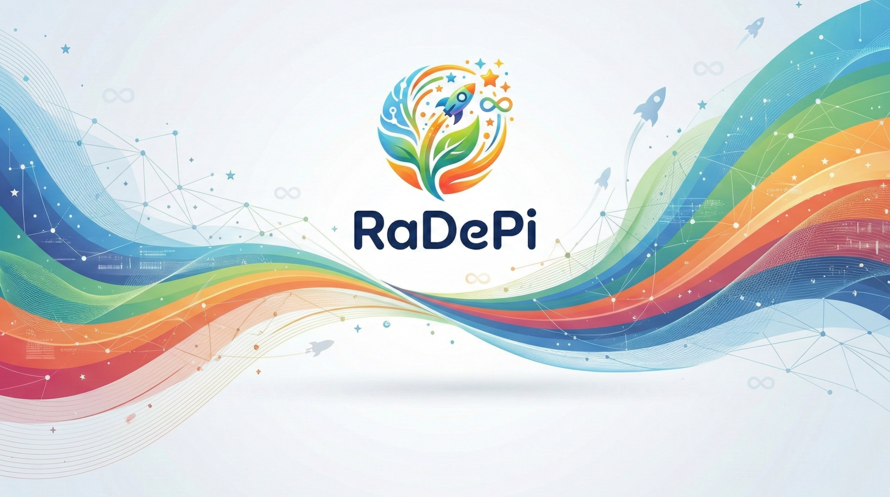

<div align="center">
  
  
  <h1>🚀 RaDePi OS</h1>
  <p><b>A secure, modern, and creator-focused Live OS based on Debian 13.</b></p>

  
  
  
</div>

<br>

## 📖 About RaDePi
RaDePi is a secure and modern educational operating system based on Debian 13. Created as an homage to the Raspberry Pi Desktop, it provides an updated environment tailored for learning, creating, and digital fabrication (CNC/Laser). RaDePi functions as a Live OS but also includes a built-in installer (Calamares), allowing users to easily install it to their local drives after trying it out.

RaDePi（ラデピ）は、Debian 13をベースにした安全でモダンな教育・クリエイター向けオペレーティングシステムです。Raspberry Pi Desktopへのオマージュとして作成され、学習やモノづくり、デジタルファブリケーション（CNC/レーザー加工）に最適な最新の環境を提供します。USBやネットワーク（iPXE）からのLive OSとして機能するだけでなく、グラフィカルなインストーラーを内蔵しているため、お試し後にそのままパソコンのHDD/SSDへ簡単にインストールすることが可能です。

---

## 🔑 Default Login Information (初期ログイン情報)
Live USBやiPXEで起動した際、またはSSHでリモート接続する際のデフォルト設定です。

* **Username (ユーザー名):** `radepi`
* **Password (パスワード):** `live`
* **Hostname (ホスト名):** `radepi`
  * *SSH Access:* `ssh radepi@radepi.local`

> **Note:** When you install RaDePi to your hard drive using the desktop installer, you will create a new personal user and password. The default `radepi` user will be safely removed, and SSH host keys will be automatically regenerated for security.</br>
> （**注:** パネルのアイコンからHDDへインストールする際、あなた自身の新しいユーザー名とパスワードを作成します。Live用の`radepi`ユーザーは安全に削除され、初回起動時に固有のSSHホストキーが自動生成・有効化されます。）

---

## ✨ Key Features (主な特徴)

* **🌍 Bilingual Ready**
  Generate both Japanese and Global (English) ISOs from a single build script.</br>
  （1つのビルドスクリプトから、日本語版とグローバル（英語版）のISOを生成可能。）

* **🎨 Digital Fab & Creator Tools**
  Essential tools for makers—such as CNCjs, Meerk40t (Native), UVtools, Blender 2.83 LTS, FreeCAD, Inkscape, Arduino IDE, KiCad, and VSCodium—are pre-configured on the panel right out of the box.</br>
  （CNCjs, Meerk40t (ネイティブ動作), UVtools, Blender 2.83 LTS, FreeCAD, Inkscape, Arduino IDE, KiCad, VSCodiumなど、モノづくりに必要なツールが最初からパネルに揃っています。）

* **🎮 Smart Input**
  Comes with `input-remapper` pre-installed, allowing you to use gamepads as wireless pendants for CNC routers and laser cutters.</br>
  （`input-remapper`を標準搭載し、ゲームパッドをCNCやレーザー加工機のワイヤレスペンダントとして活用可能。）

* **⚡ Highly Optimized & NFS Ready**
  ZRAM (swap compression) is enabled by default, with full support for iPXE + NFS network booting. Runs smoothly over the network even on older, low-memory PCs.</br>
  （ZRAM（スワップ圧縮）のデフォルト有効化に加え、iPXE + NFSブートに完全対応。メモリの少ない古いPCでもネットワーク経由で軽快に動作します。）

* **🛠 Built-in Installer**
  Includes the "Calamares" installer, allowing you to install the OS with a few clicks from the Live environment panel, just like Ubuntu. Once installed, the installer icon is automatically removed to keep your desktop clean.</br>
  （Ubuntuのように、Live環境のパネルから数クリックでOSをインストールできる「Calamares」を搭載。インストール後はアイコンが自動で消去され、デスクトップをクリーンに保ちます。）

---

## 📸 Screenshots (スクリーンショット)

Includes 3 official themes (wallpapers) by default. Choose the one that best suits your task or mood.</br>
（用途や気分に合わせて選べる、3つの公式テーマ（壁紙）を標準収録しています。）

<div align="center">
  <table>
    <tr>
      <td align="center"><b>Default Theme</b><br>メインテーマ</td>
      <td align="center"><b>Education Theme</b><br>教育・プログラミング</td>
      <td align="center"><b>Relax Theme</b><br>リラックス・カフェ</td>
    </tr>
    <tr>
      <td></td>
      <td></td>
      <td></td>
    </tr>
  </table>
</div>

---

## 🏗️ How to Build (ISOのビルド方法)
RaDePi uses a highly automated `live-build` script. </br>
（RaDePiは高度に自動化されたビルドスクリプトを使用しています。）

```bash
# Clone the repository
git clone [https://github.com/flatstyle-open/RaDePi.git](https://github.com/flatstyle-open/RaDePi.git)
cd RaDePi

# Run the build script (You can change BUILD_LANG to "ja" or "en" inside the script)

chmod +x scripts/build.sh
./scripts/build.sh
```

## 🌐 Network Boot (起動の設定例)
RaDePi is optimized for network booting. Here is an example of an menu configuration:</br>
（RaDePiはネットワークブートに最適化されています。メニューの記述例です。）

```bash
kernel [IP]/[tft-path]/vmlinuz boot=live netboot=nfs nfsroot=[IP]/[nfs-path]/radepi ip=dhcp rw quiet splash initrd=initrd.img live-media-path=/
initrd [IP]/[tft-path]/initrd.img
```

**Example: Booting the Japanese Edition in Japanese**</br>
（例：日本語版を日本語で起動させる場合）
```bash
kernel [IP]/[tft-path]/vmlinuz boot=live netboot=nfs nfsroot=[IP]/[nfs-path]/radepi ip=dhcp rw quiet splash initrd=initrd.img live-media-path=/ locales=ja_JP.UTF-8 keyboard-layouts=jp timezone=Asia/Tokyo
initrd [IP]/[tft-path]/initrd.img
```

